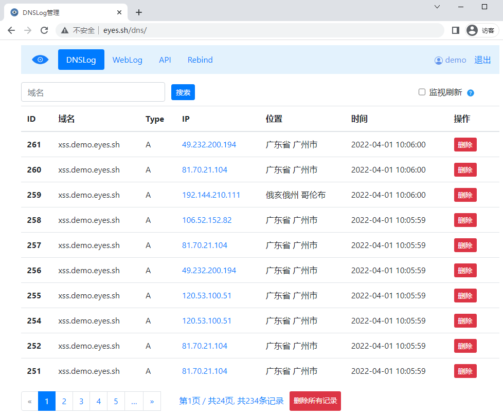
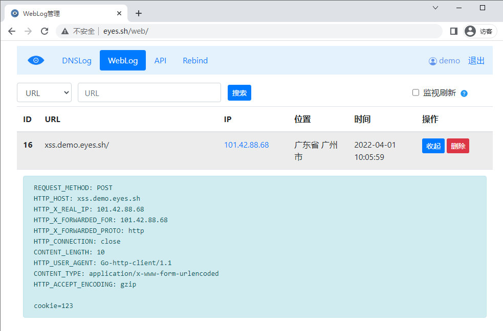
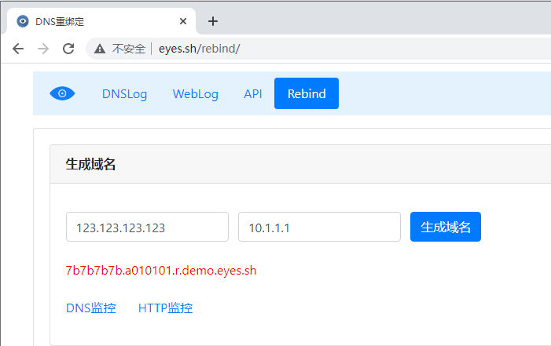

# eyes.sh 1.0.2

View this doc in [English](README_EN.md).

[eyes.sh](http://eyes.sh/)是用来辅助安全测试和漏扫工具的DNS Log / HTTP Log检测工具，基于 [BugScan DNSLog](https://github.com/bugscanteam/dnslog/) 优化（感谢四叶草安全、感谢坤哥  :) ）。

访问 [http://eyes.sh/](http://eyes.sh/)  

* 演示账号 `demo` / `demo@pass`，请注意，该账号删除功能无效
* 也可以在登录页面中选择 `创建随机ID并登录`

## Chang Log 

* 2022-04-09： 增加多语言支持，添加英文翻译
* 2022-04-06： 注册用户名，限制只允许使用字母数字

## **背景** 

* 公司内部扫描器每天产生数百万次DNS Log接口调用
* 因为一些原因，DNSLog服务部署在低配置的海外VPS，这给扫描系统造成了瓶颈

## 增强的功能

* 更加友好的分页、删除、查看指定IP，增加搜索功能，增加显示IP定位、显示Request Headers、捕获Request Body
* 支持监控新记录自动刷新（可以关键词过滤，关注特定目标或特定漏洞）
* 支持DNS重绑定
* 接口优化，增加支持Group DNS查询，减少扫描器的接口调用次数
  * 例如，扫描器先以 `(主机名+任务ID）`做DNS前缀，投递完所有payloads，任务结束时，通过单个查询，检查是否有漏洞被触发
* API接口域名TTL为0，导致过多无意义查询，修正为1200
  * 原来每次API请求都将产生额外的DNS查询
* 增加了注册、一键生成随机域名、简单管理开关、简单登录锁定等
* 数据库优化，后端使用MySQL ，增加索引，数百万记录下查询性能较好

安装部署
---

#### 域名和公网 IP 

以部署 `eyes.sh` 网站为例。部署服务时，临时地，需要用到两个域名（其中一个只需要添加2个A记录，作为 `eyes.sh` 的NS记录值）

因为 `eyes.sh` 解析尚未生效，所以你暂时还不能以 `ns.eyes.sh` 来作为 `eyes.sh`的NS记录，但服务配置生效之后可以再改过去

* 设置 `eyes.sh` NS 记录为`eyes_dns1.lijiejie.com`， 然后把 `eyes_dns1.lijiejie.com`指向你的服务器IP

```
eyes.sh nameserver = eyes_dns1.lijiejie.com
eyes.sh nameserver = eyes_dns2.lijiejie.com
```

#### Django工程 

**Python 3.8 + Django 4.0**， 参考 `deploy.sh`文件中的命令清单进行部署，MySQL的安装需要交互 

* 海外VPS请注意 时区设置、MySQL编码设置

在 `\dnslog\settings.py` 文件中，配置好服务域名，关闭`DEBUG`开关、配置 `DATABASES` 

```
DNS_DOMAIN = 'eyes.sh'   # 用于DNS记录的域名
ADMIN_DOMAIN = ['eyes.sh', 'www.eyes.sh']  # 管理后台域名

# NS记录值
NS1_DOMAIN = 'eyes_dns1.lijiejie.com'
NS2_DOMAIN = 'eyes_dns2.lijiejie.com'

SERVER_IP = '123.123.123.123'  # 你的服务器外网IP
```

Nginx配置文件为目录下 `dnslog_nginx.conf`

#### 创建管理员账号

系统部署完成后，**创建的第一个账号为系统管理员**。建议： 在本地绑定hosts的情况下，提前完成账号的创建。

## 功能截图








## License

[GPL-2.0](GPL-2.0)