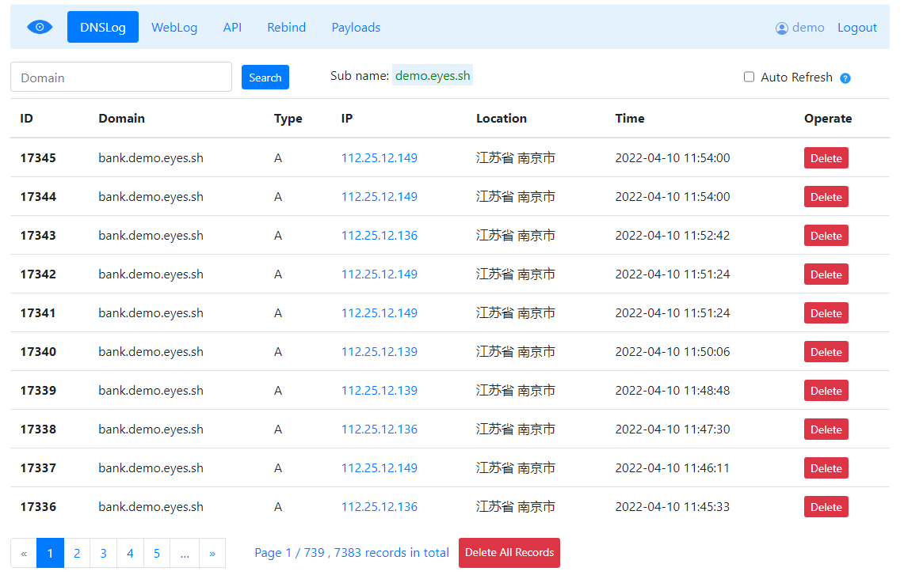
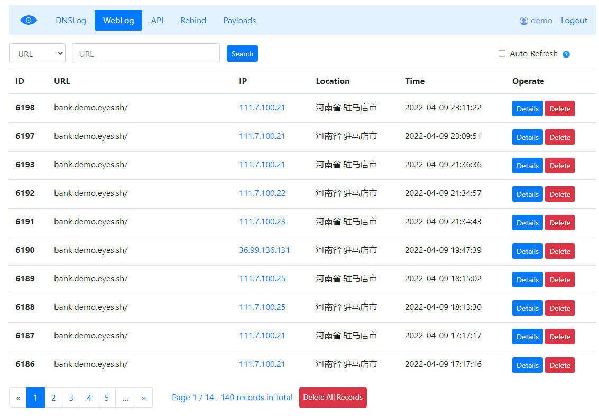

# eyes.sh 1.0.3

View this doc in [Chinese](README.md).

[eyes.sh](http://eyes.sh/) is a simple DNS / HTTP logger which can be used by pentesters or scanners to identify and locate vulnerable targets. 

Mostly used to find vulerabilities like SSRF / Blind SQL Injection / Blind RCE / Stored XSS.

* In some cases, target can send DNS queries but http requests were blocked by Firewall,  you can use eyes.sh to monitor if any DNS Queries captured 
* In some cases, RCE or SSRF were triggered by a group of hosts, you can use eyes.sh to capture http requests and get their IPs/Headers/Location
* ...

This project is based on  [BugScan DNSLog](https://github.com/bugscanteam/dnslog/) .

Demo site  [http://eyes.sh/](http://eyes.sh/)  

* Login with `demo` / `demo@pass`，the delete function was disabled
* You can also click `Login as random new user`

## Chang Log 

* 2024-06-02： Bug fixed, a sync IP to geo location search (by HTTP) made DNS Server response too slow, especially under high concurrency queries
* 2022-04-09： Add english translation

Install
---

#### Prepare Domain Names 

 Let's have `eyes.sh`  installation as a show case.

When install the service，you were required to control two domain names（One is to add two type `A` records,  and later set them as `NS` records for `eyes.sh`）

* Add `eyes_dns1.lijiejie.com`  `eyes_dns2.lijiejie.com` , resolve to your Server IP
* Set `eyes_dns1.lijiejie.com`  `eyes_dns2.lijiejie.com` as  `eyes.sh` name server

```
eyes.sh nameserver = eyes_dns1.lijiejie.com
eyes.sh nameserver = eyes_dns2.lijiejie.com
```

#### Django 

This project works with **Python 3.8 + Django 4.0**， run `deploy.sh` to install dependencies.

* Modify TimeZone in settings.py 
* MySQL Server charset should be updated to utf-8

Edit `\dnslog\settings.py`, add your service domain，IP  and  `DATABASES` 

```
DNS_DOMAIN = 'eyes.sh'   # Service Domain
ADMIN_DOMAIN = ['eyes.sh', 'www.eyes.sh']  # Reserved domains to view records

# name server
NS1_DOMAIN = 'eyes_dns1.lijiejie.com'
NS2_DOMAIN = 'eyes_dns2.lijiejie.com'

SERVER_IP = '123.123.123.123'  # Your server IP
```

Nginx config file is `dnslog_nginx.conf`

#### Add Sys Admin

When install completed，**the first registerd user will become the sys admin by default**.

## Screenshot







## License

[GPL-2.0](GPL-2.0)